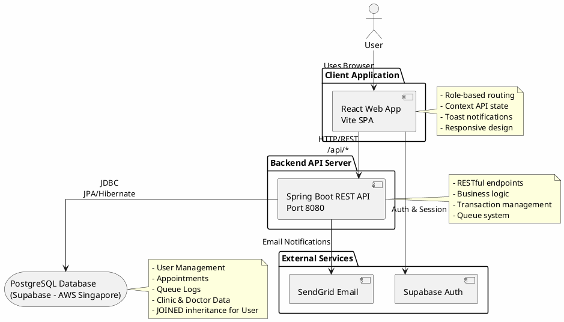
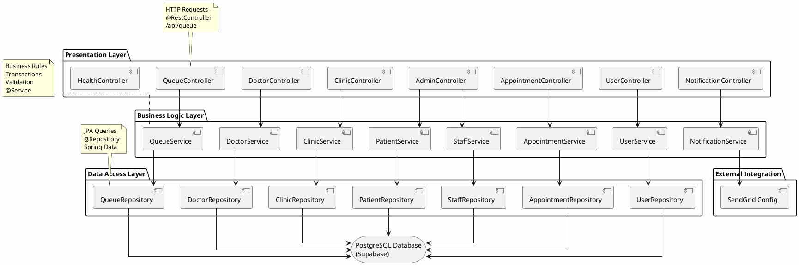
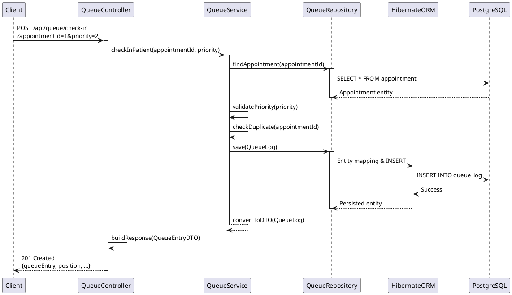
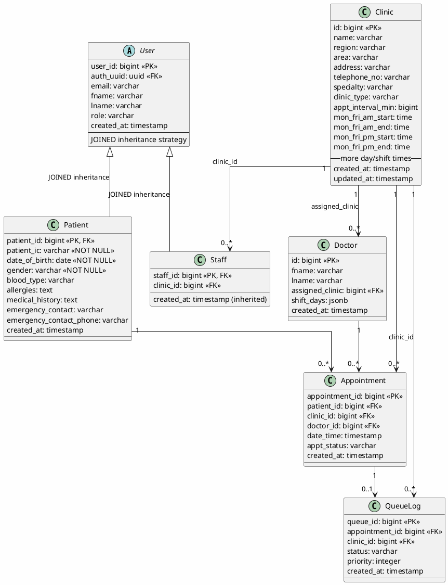
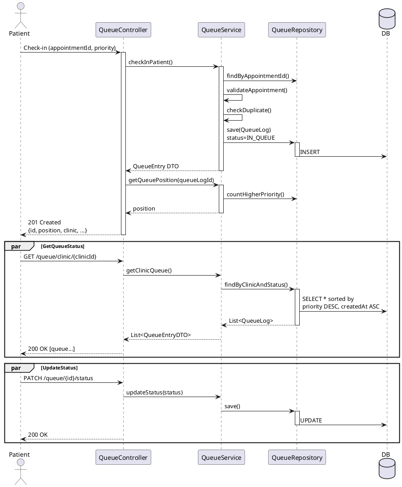
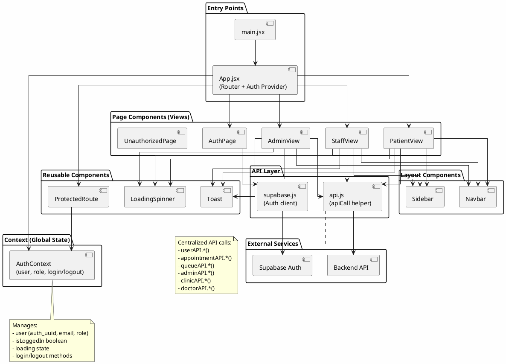
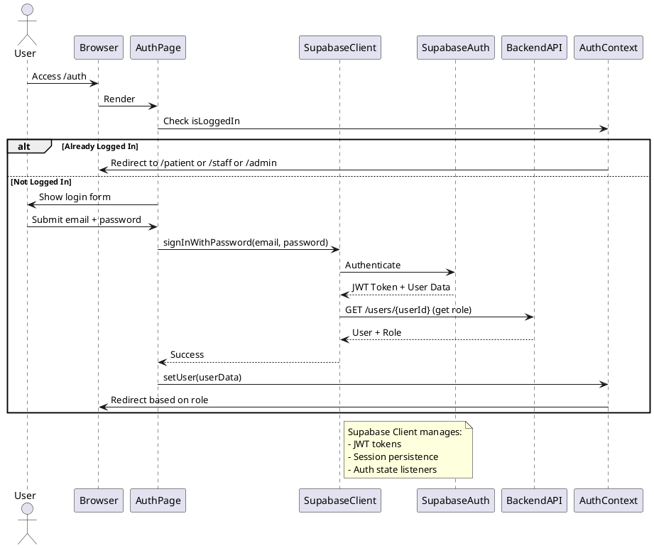
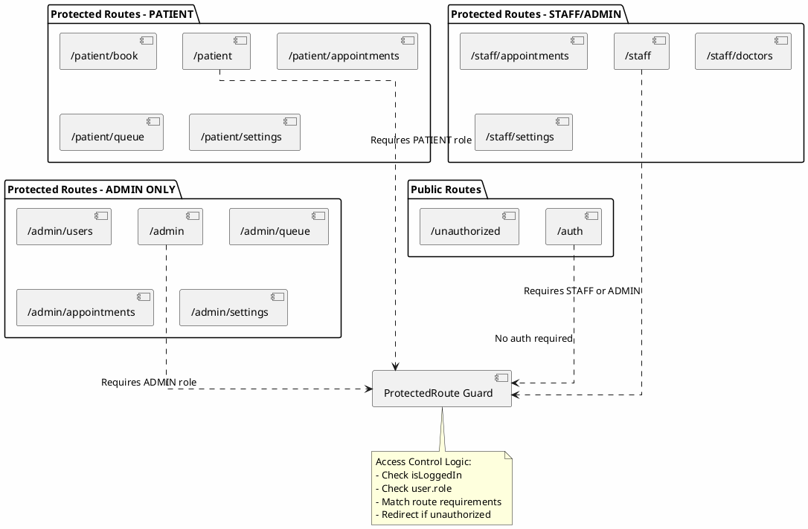
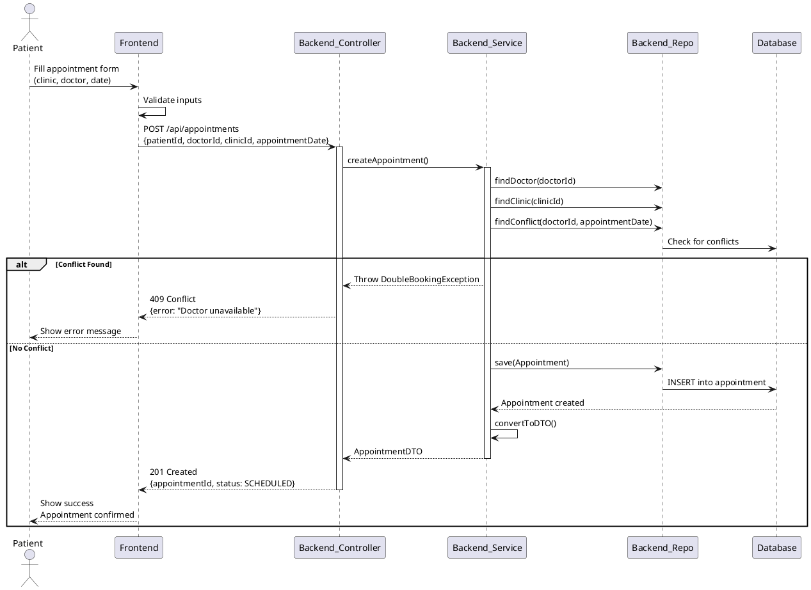
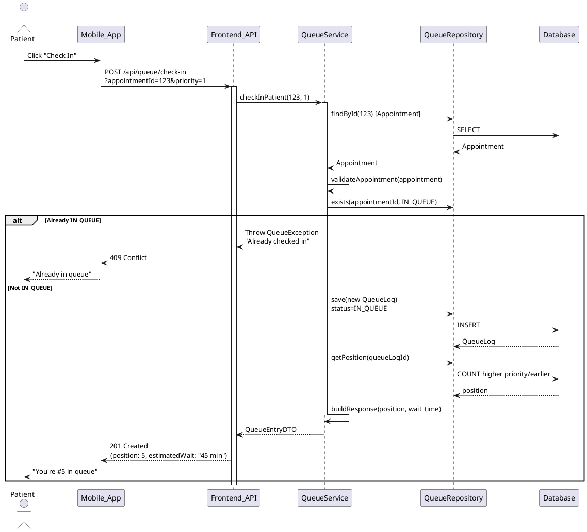

# SingHealth Clinic Queue & Appointment Management System - Architecture Documentation

## Overview

This document describes the architecture of the SingHealth Clinic Queue & Appointment Management System, a healthcare application designed to manage patient appointments and queue management across multiple clinics.

**Architecture Type:** MVC-inspired 3-Layer Layered Architecture
**Frontend:** React 19 + Vite
**Backend:** Spring Boot 3.5.6 + Java 21
**Database:** PostgreSQL (Supabase hosted)
**Authentication:** Supabase Auth

---

## 1. System Overview



---

## 2. Backend Architecture - 3-Layer Pattern

### 2.1 Component Architecture



### 2.2 Request Flow Through Layers



---

## 3. Entity Relationship Diagram



---

## 4. Backend - Queue Management System



---

## 5. Frontend Architecture

### 5.1 Component & Page Structure



### 5.2 Authentication Flow



---

## 6. Frontend Routing & Access Control



---

## 7. API Endpoints Architecture

### 7.1 Queue Management API

```
POST   /api/queue/check-in
       Query: appointmentId, priority
       Response: 201 Created {id, position, clinic, patient, status}

GET    /api/queue/clinic/{clinicId}
       Response: 200 OK [QueueLog...]
       Sorted by: priority DESC, createdAt ASC

GET    /api/queue/position/{appointmentId}
       Response: 200 OK {position, estimatedWait}

PATCH  /api/queue/{queueId}/status
       Body: {status: "DONE" | "MISSED"}
       Response: 200 OK {updated QueueLog}

POST   /api/queue/requeue/{appointmentId}
       Response: 201 Created {new QueueLog}

GET    /api/queue/clinic/{clinicId}/currently-serving
       Response: 200 OK {current QueueLog}

GET    /api/queue/clinic/{clinicId}/missed
       Response: 200 OK [missed QueueLogs...]
```

### 7.2 Appointment Management API

```
GET    /api/appointments
       Response: 200 OK [Appointment...]

POST   /api/appointments
       Body: {patientId, doctorId, clinicId, appointmentDate}
       Response: 201 Created {Appointment}
       Validates: No double-booking, clinic exists, doctor available

PUT    /api/appointments/{id}
       Response: 200 OK {updated Appointment}

DELETE /api/appointments/{id}
       Response: 204 No Content

GET    /api/appointments/patient/{patientId}
       Response: 200 OK [Appointment...]

PATCH  /api/appointments/{id}/status
       Body: {status: AppointmentStatus}
       Response: 200 OK {updated Appointment}
```

---

## 8. Data Flow Diagrams

### 8.1 Patient Books Appointment



### 8.2 Patient Checks In to Queue



---

## 9. Technology Stack

### Backend Stack
```
┌─────────────────────────────────────────────────────────┐
│ Spring Boot 3.5.6 with Java 21                          │
├─────────────────────────────────────────────────────────┤
│ Core Dependencies:                                      │
│  • spring-boot-starter-web        (REST APIs)          │
│  • spring-boot-starter-data-jpa   (ORM)                │
│  • spring-boot-devtools           (Development)        │
│  • lombok                          (Code generation)    │
│  • springdoc-openapi               (Swagger/OpenAPI)   │
│  • sendgrid-java                   (Email service)      │
│  • spring-dotenv                   (Env variables)      │
├─────────────────────────────────────────────────────────┤
│ Database Layer:                                         │
│  • Hibernate (ORM)                                      │
│  • JPA Repositories                                     │
│  • PostgreSQL JDBC Driver                              │
│  • HikariCP (Connection pooling)                        │
├─────────────────────────────────────────────────────────┤
│ Build & Runtime:                                        │
│  • Maven (Build tool)                                   │
│  • Spring Boot Embedded Tomcat (Port 8080)             │
└─────────────────────────────────────────────────────────┘
```

### Frontend Stack
```
┌─────────────────────────────────────────────────────────┐
│ React 19.1.1 with Vite 7.1.7                            │
├─────────────────────────────────────────────────────────┤
│ Core Dependencies:                                      │
│  • react-dom                       (DOM rendering)      │
│  • react-router-dom                (Routing)            │
│  • @supabase/supabase-js           (Auth & API)         │
│  • node-fetch                      (HTTP requests)      │
├─────────────────────────────────────────────────────────┤
│ Development Tools:                                      │
│  • Vite (Build tool & dev server)                       │
│  • ESLint (Linting)                                     │
│  • @vitejs/plugin-react                                 │
├─────────────────────────────────────────────────────────┤
│ Styling:                                                │
│  • CSS (Component-scoped + Global)                      │
│  • CSS Custom Properties (Variables)                    │
│  • No CSS-in-JS libraries                               │
├─────────────────────────────────────────────────────────┤
│ State Management:                                       │
│  • React Context API (Authentication)                   │
│  • useState/useEffect hooks (Component state)           │
└─────────────────────────────────────────────────────────┘
```

### Database
```
┌─────────────────────────────────────────────────────────┐
│ Supabase (Managed PostgreSQL)                           │
├─────────────────────────────────────────────────────────┤
│ Instance Details:                                       │
│  • PostgreSQL database                                  │
│  • Hosted on AWS (ap-southeast-1, Singapore)           │
│  • JOINED table inheritance for User entity             │
│  • JSONB columns for complex data (e.g., shiftDays)    │
├─────────────────────────────────────────────────────────┤
│ Connection:                                             │
│  • Backend: Direct JDBC/Hibernate (HikariCP pooling)   │
│  • Frontend: Supabase client (auth only)                │
│  • Max connections: 5 (configurable)                    │
├─────────────────────────────────────────────────────────┤
│ Schema Management:                                      │
│  • JPA/Hibernate DDL auto-update                        │
│  • No migration tool (Flyway/Liquibase)                │
│  • Tables created on first deployment                   │
└─────────────────────────────────────────────────────────┘
```

### External Services
```
┌─────────────────────────────────────────────────────────┐
│ SendGrid (Email Notifications)                          │
├─────────────────────────────────────────────────────────┤
│ Usage:                                                  │
│  • Appointment confirmations                            │
│  • "3 patients away" alerts                             │
│  • "Your turn" notifications                            │
│  • HTML email templates with inline CSS                │
│  • Configured via config/SendGridConfig.java            │
└─────────────────────────────────────────────────────────┘

┌─────────────────────────────────────────────────────────┐
│ Supabase Auth (Authentication)                          │
├─────────────────────────────────────────────────────────┤
│ Usage:                                                  │
│  • User authentication (email/password)                 │
│  • JWT token generation                                 │
│  • Session management                                   │
│  • Frontend integration via Supabase JS client          │
└─────────────────────────────────────────────────────────┘
```

---

## 10. Complete List of Open Source Libraries

### Backend Libraries (Java/Spring Boot)

#### Core Spring Boot Framework
| Library | Version | Purpose | License |
|---------|---------|---------|---------|
| spring-boot-starter-parent | 3.5.6 | Spring Boot parent POM for dependency management | Apache 2.0 |
| spring-boot-starter-web | 3.5.6 | Spring MVC, REST APIs, embedded Tomcat | Apache 2.0 |
| spring-boot-starter-data-jpa | 3.5.6 | Spring Data JPA with Hibernate ORM | Apache 2.0 |
| spring-boot-devtools | 3.5.6 | Hot reload and development utilities | Apache 2.0 |
| spring-boot-starter-test | 3.5.6 | JUnit 5, Mockito, AssertJ testing framework | Apache 2.0 |

#### ORM & Database
| Library | Version | Purpose | License |
|---------|---------|---------|---------|
| Hibernate ORM | (via JPA) | Object-Relational Mapping framework | LGPL 2.1 |
| Jakarta Persistence API (JPA) | (via Spring) | Standard Java persistence API | Eclipse Public License 2.0 |
| postgresql | (runtime) | PostgreSQL JDBC Driver for database connections | BSD 2-Clause |
| HikariCP | (via Spring) | High-performance JDBC connection pooling library | Apache 2.0 |

#### Code Generation & Utilities
| Library | Version | Purpose | License |
|---------|---------|---------|---------|
| lombok | (latest) | Reduce boilerplate code with annotations (@Data, @Getter, @Setter, etc.) | MIT |
| spring-dotenv | 3.0.0 | Load environment variables from .env files | Apache 2.0 |

#### API Documentation
| Library | Version | Purpose | License |
|---------|---------|---------|---------|
| springdoc-openapi-starter-webmvc-ui | 2.2.0 | Swagger UI and OpenAPI 3.0 documentation | Apache 2.0 |
| swagger-core | (transitive) | OpenAPI/Swagger core library | Apache 2.0 |

#### Email & External Services
| Library | Version | Purpose | License |
|---------|---------|---------|---------|
| sendgrid-java | 4.10.2 | SendGrid email service Java client | MIT |
| jackson-databind | (transitive) | JSON processing library | Apache 2.0 |

#### Build Tools
| Tool | Purpose | License |
|------|---------|---------|
| Maven 3.8+ | Build automation and dependency management | Apache 2.0 |
| Apache Maven Compiler Plugin | Java source code compilation | Apache 2.0 |
| Spring Boot Maven Plugin | Package executable JAR files | Apache 2.0 |

---

### Frontend Libraries (React/JavaScript)

#### Core Framework
| Library | Version | Purpose | License |
|---------|---------|---------|---------|
| React | 19.1.1 | JavaScript library for building user interfaces | MIT |
| React DOM | 19.1.1 | React DOM rendering library | MIT |
| react-router-dom | 7.9.5 | Client-side routing for React applications | MIT |

#### Authentication & API
| Library | Version | Purpose | License |
|---------|---------|---------|---------|
| @supabase/supabase-js | 2.78.0 | Supabase client for authentication and realtime database | Apache 2.0 |
| node-fetch | 2.7.0 | Lightweight Fetch API for Node.js (HTTP requests) | MIT |

#### Build & Development Tools
| Tool | Version | Purpose | License |
|------|---------|---------|---------|
| Vite | 7.1.7 | Modern JavaScript build tool and development server | MIT |
| @vitejs/plugin-react | 5.0.4 | React support plugin for Vite | MIT |
| ESLint | 9.36.0 | JavaScript linting tool for code quality | MIT |
| @eslint/js | 9.36.0 | ESLint JavaScript configuration | MIT |
| eslint-plugin-react-hooks | 5.2.0 | ESLint plugin for React Hooks rules | MIT |
| eslint-plugin-react-refresh | 0.4.22 | ESLint plugin for React Fast Refresh | MIT |
| globals | 16.4.0 | Global variable definitions for ESLint | MIT |

#### TypeScript Support (Development)
| Library | Version | Purpose | License |
|---------|---------|---------|---------|
| @types/react | 19.1.16 | TypeScript type definitions for React | MIT |
| @types/react-dom | 19.1.9 | TypeScript type definitions for React DOM | MIT |

#### Styling
| Approach | Purpose |
|----------|---------|
| CSS (Component-scoped) | Native CSS without external libraries |
| CSS Custom Properties (Variables) | CSS variables for theming |
| No CSS-in-JS | Chose native CSS for simplicity |

---

### Transitive & Indirect Dependencies

These libraries are pulled in automatically by the main dependencies:

#### Jackson (JSON Processing)
- **jackson-databind** - JSON serialization/deserialization
- **jackson-core** - Low-level JSON processing
- **jackson-annotations** - JSON annotations

#### Spring Framework Core
- **spring-core** - Core Spring Framework utilities
- **spring-context** - Application context and dependency injection
- **spring-beans** - Bean definitions and management
- **spring-aop** - Aspect-oriented programming support
- **spring-tx** - Transaction management

#### Testing Frameworks (Transitive)
- **JUnit 5** - Unit testing framework
- **Mockito** - Mocking library for unit tests
- **AssertJ** - Fluent assertions for tests
- **Hamcrest** - Matcher library for assertions

#### Other Transitive Dependencies
- **slf4j-api** - Logging facade (Simple Logging Facade for Java)
- **logback-classic** - Logging implementation
- **commons-logging** - Apache Commons Logging
- **snakeyaml** - YAML parsing for configuration

---

### External Managed Services (Not Included as Code)

| Service | Purpose | Provider |
|---------|---------|----------|
| Supabase PostgreSQL | Managed PostgreSQL database hosting | Supabase (AWS infrastructure) |
| Supabase Auth | Authentication service with JWT | Supabase |
| SendGrid | Email delivery service | SendGrid |

---

### Library Statistics

**Backend Dependencies:**
- Total direct dependencies: 8 libraries
- Total transitive dependencies: 50+
- Largest dependency graph: Spring Boot ecosystem

**Frontend Dependencies:**
- Total direct dependencies: 5 libraries
- Total dev dependencies: 7 tools
- Total dependencies: 12 libraries/tools

**Total Open Source Libraries Used: 70+**

---

### Key Dependency Insights

**Why These Libraries?**

1. **Spring Boot (3.5.6)** - Industry standard for Java REST APIs with excellent ecosystem
2. **React (19.1.1)** - Modern, component-based UI framework with large community
3. **Vite** - Fast build tool and dev server (10-100x faster than traditional bundlers)
4. **Supabase** - Open-source Firebase alternative with PostgreSQL
5. **Lombok** - Reduces Java boilerplate significantly (less code to maintain)
6. **React Router** - Standard routing solution for React SPAs
7. **SendGrid** - Reliable email service with good Java integration
8. **ESLint** - Essential for maintaining code quality in JavaScript

**License Compliance:**
- **MIT License:** Most React/Vite ecosystem libraries (permissive, business-friendly)
- **Apache 2.0:** Spring Boot and most Java libraries (permissive, patent protection)
- **LGPL 2.1:** Hibernate (copyleft but allows linking)
- **BSD 2-Clause:** PostgreSQL JDBC (permissive)

✅ **All libraries are open source and free for commercial use**

---

## 11. Architectural Patterns & Design Decisions

### Backend Patterns

**1. Layered Architecture (3-Tier)**
- Clear separation: Controller → Service → Repository
- Advantages: Easy to test, maintain, and scale
- Each layer has single responsibility

**2. Repository Pattern**
```java
// Spring Data JPA automatically generates implementations
public interface QueueRepository extends JpaRepository<QueueLog, Long> {
    List<QueueLog> findByClinicIdAndStatus(Long clinicId, String status);
}
```

**3. Service Layer Pattern**
- Encapsulates business logic
- Transaction management via @Transactional
- DTO conversion (internal entity → external API contract)
- Cross-entity operations

**4. DTO (Data Transfer Object) Pattern**
- Separates API contract from internal entities
- Input validation
- Response formatting
- Prevents exposing internal structure

**5. Dependency Injection (Constructor-based)**
```java
@RequiredArgsConstructor  // Lombok generates constructor
public class QueueService {
    private final QueueRepository queueRepository;
    private final AppointmentRepository appointmentRepository;
}
```

**6. Entity Inheritance (JOINED Strategy)**
```
User (base table)
  ├── Patient (extends User) - separate table joined on PK
  └── Staff (extends User) - separate table joined on PK
```

**7. Custom Exception Handling**
- Domain-specific exceptions (QueueException, DoubleBookingException)
- Mapped to appropriate HTTP status codes
- Standardized error responses

**8. Transaction Management**
```java
@Transactional                    // Read-write transactions
public QueueLog checkInPatient(...) { }

@Transactional(readOnly = true)   // Read-only optimization
public List<QueueLog> getClinicQueue(...) { }
```

### Frontend Patterns

**1. Component-Based Architecture**
- Small, reusable, single-responsibility components
- Composition over inheritance
- Props-driven component behavior

**2. Context API for Global State**
- AuthContext manages authentication state
- useAuth custom hook for convenience
- Reduces prop drilling

**3. Route-Based Code Organization**
- Pages organized by user role
- Protected routes with ProtectedRoute component
- Role-based navigation

**4. API Client Abstraction**
- Centralized api.js module
- Domain-organized API services
- Error handling at single point
- Easy to mock/test

**5. Separation of Concerns**
- lib/ - Utility and integration code
- pages/ - View components
- components/ - Reusable UI components
- contexts/ - State management

**6. Functional Components with Hooks**
- No class components
- useState for local state
- useEffect for side effects
- Custom hooks (useAuth)

**7. Role-Based Access Control**
```javascript
<ProtectedRoute requiredRole="PATIENT">
  <PatientView />
</ProtectedRoute>
```

---

## 12. Software Design Principles & Best Practices


  ```

### Additional Design Principles

**DRY (Don't Repeat Yourself)**
- Shared validation logic in service layer
- Common query patterns in repositories
- Reusable API client methods in api.js
- Shared components (Navbar, Sidebar, Toast)
- Base entity with `created_at` timestamp in all tables

**KISS (Keep It Simple, Stupid)**
- Simple 3-layer architecture, not over-engineered
- PlainSQL for most queries, complex queries only when needed
- React hooks instead of Redux (simpler state management)
- Straightforward queue algorithm (priority + timestamp)
- No unnecessary design patterns

**YAGNI (You Aren't Gonna Need It)**
- No caching layer (added if performance bottleneck identified)
- No event sourcing or CQRS
- No microservices (monolithic but organized)
- No complex ORM mappings
- No unnecessary abstractions

**Composition Over Inheritance**
- React components use composition (Navbar + Sidebar + Content)
- Service composition in queue management
- Mix and match different validators for appointments
- DTO composition for complex responses

**Don't Repeat Yourself in Tests**
- Reusable test fixtures and builders
- Mock repositories shared across tests
- Common assertion helpers

---

## 13. Nielsen's 10 Usability Heuristics - Frontend Analysis

Nielsen's 10 Usability Heuristics guide how user-friendly interfaces should be. Here's how the current frontend implementation aligns and where improvements could be made:

### 1. Visibility of System Status ✅ Implemented
**Heuristic:** Users should always be informed about what is happening

**Current Implementation:**
- LoadingSpinner component shows when data is being fetched
- Toast notifications provide feedback on actions (success/error)
- Queue position clearly displays where patient is in queue
- Appointment status visually displayed (SCHEDULED, CONFIRMED, COMPLETED, etc.)
- Real-time queue updates when patient checks in

**Could Improve:**
- Add loading indicators for long API calls
- Show progress bars for multi-step processes
- Display server-side error details in toast messages
- Add "saving..." indicators during form submission

### 2. Match Between System and Real World ✅ Implemented
**Heuristic:** Use language and concepts familiar to users

**Current Implementation:**
- Queue terminology matches healthcare industry standard (check-in, priority, waiting)
- "Queue position" and "estimated wait time" are familiar to patients
- Role-based navigation (Patient/Staff/Admin) matches organizational structure
- Appointment status uses industry terms (SCHEDULED, CONFIRMED, NO_SHOW)
- Clinic names, doctors, and regions in patient's native language/context

**Could Improve:**
- Add tooltips explaining technical terms (priority levels, triage)
- Use icons alongside text for international accessibility
- Add help documentation for complex features
- Provide contextual information (why queue priority exists)

### 3. User Control and Freedom ✅ Partially Implemented
**Heuristic:** Users need emergency exits; undo/redo functionality

**Current Implementation:**
- Users can cancel appointments (DELETE endpoint exists)
- Navigate freely between pages with sidebar menu
- Logout functionality available in all views
- Role-based views prevent accidental access to restricted areas

**Could Improve:**
- Add "cancel" buttons in modal dialogs
- Implement appointment reschedule instead of delete + rebook
- Add undo for recent actions (cancelled appointment)
- Provide "back" button navigation
- Allow users to modify pending appointments
- Confirm before destructive actions (delete, cancel)

### 4. Error Prevention ⚠️ Partially Implemented
**Heuristic:** Prevent problems before they occur

**Current Implementation:**
- ProtectedRoute prevents unauthorized access
- Required fields marked in forms
- Role-based access control prevents wrong users accessing features
- Backend validates double-booking

**Could Improve:**
- Add client-side form validation before submission
- Show real-time conflict detection for appointment booking
- Warn when scheduling outside clinic hours
- Prevent double-submission with disabled submit buttons
- Validate appointment date is in future
- Check clinic availability before showing appointment slots

### 5. Error Messages ⚠️ Needs Improvement
**Heuristic:** Error messages should be plain language, suggest solutions

**Current Implementation:**
- Toast notifications display API errors
- Errors bubbled up from backend with context

**Could Improve:**
- Convert technical errors to user-friendly messages
- Example: "Doctor unavailable at this time" instead of "409 Conflict"
- Provide actionable suggestions (reschedule to different time, different doctor)
- Use error codes with specific guidance
- Show what went wrong in form validation clearly
- Offer next steps (call clinic, try again later, contact support)

### 6. Recognition Rather Than Recall ✅ Implemented
**Heuristic:** Users shouldn't have to remember; make options visible

**Current Implementation:**
- Sidebar menu always visible with current page highlighted
- Appointments listed with full details (doctor, clinic, time)
- Queue status shows clinic name, appointment details
- Role-based navigation shows only relevant options
- Color-coded status badges (SCHEDULED, CONFIRMED, DONE, MISSED)
- Breadcrumbs/navigation hierarchy clear

**Could Improve:**
- Add breadcrumb navigation
- Show recently viewed items
- Add search/filter for appointments
- Display saved preferences
- Show doctor/clinic suggestions based on history

### 7. Flexibility and Efficiency of Use ✅ Implemented
**Heuristic:** Shortcuts for experienced users, progressive disclosure for beginners

**Current Implementation:**
- Role-based shortcuts (Patient sees appointments, Staff sees queue)
- Common actions in main navigation
- Direct access to queue status from dashboard
- Quick check-in from mobile app
- Keyboard accessible (React components)

**Could Improve:**
- Add keyboard shortcuts (Ctrl+A for appointments, Q for queue)
- Bulk operations (cancel multiple appointments)
- Advanced filters for searching appointments
- Customizable dashboard widgets
- Saved views and filters
- API keyboard navigation support

### 8. Aesthetic and Minimalist Design ✅ Implemented
**Heuristic:** Remove unnecessary information; focus on essentials

**Current Implementation:**
- Clean, minimal UI with maroon color scheme
- Card-based layouts with clear hierarchy
- No flashy animations or distractions
- Simple navigation structure
- Essential information prioritized
- Responsive design for all screen sizes
- Typography is clear and readable

**Could Improve:**
- Reduce visual clutter in queue display
- Simplify forms by hiding advanced options
- Progressive disclosure for complex features
- Remove unused UI elements
- Consolidate related information into tabs/panels

### 9. Help and Documentation 🔴 Not Implemented
**Heuristic:** Easy-to-search help and task-focused documentation

**Current Implementation:**
- Swagger UI for backend API documentation
- README files in backend/frontend directories
- ARCHITECTURE.md (this file) for system design
- CLAUDE.md and QUEUE_IMPLEMENTATION.md for developers

**Needs Implementation:**
- In-app help documentation
- FAQ section for common questions
- Tooltips explaining features
- Video tutorials for complex workflows
- Context-sensitive help for each page
- Help icons next to complex features
- Chat support or contact form
- Onboarding tutorial for new users
- Print-friendly appointment confirmations

### 10. Help Users Recognize, Diagnose, and Recover from Errors 🔴 Needs Improvement
**Heuristic:** Error messages in plain language with suggestions

**Current Implementation:**
- Backend returns HTTP status codes
- Toast notifications display errors
- Custom exceptions (QueueException, DoubleBookingException)

**Needs Implementation:**
- Convert error codes to user-friendly messages:
  ```
  409 Conflict → "Time slot not available. Try these alternatives..."
  404 Not Found → "Appointment not found. It may have been cancelled."
  400 Bad Request → "Please check your input: [specific field errors]"
  ```
- Suggest recovery actions
- Log errors for support team
- Provide error reference codes for support
- Explain why error occurred in user's context
- Offer alternative solutions

---

### Summary: Nielsen's Heuristics Compliance

| Heuristic | Status | Priority |
|-----------|--------|----------|
| 1. System Status Visibility | ✅ Good | - |
| 2. System/Real World Match | ✅ Good | - |
| 3. User Control & Freedom | ⚠️ Partial | Medium |
| 4. Error Prevention | ⚠️ Partial | High |
| 5. Error Messages | ⚠️ Weak | High |
| 6. Recognition vs Recall | ✅ Good | - |
| 7. Flexibility & Efficiency | ✅ Good | Low |
| 8. Aesthetic & Minimalist | ✅ Good | - |
| 9. Help & Documentation | 🔴 Missing | High |
| 10. Error Recovery | 🔴 Weak | High |

**Recommended Improvements Priority:**
1. **High Priority:** Error messages (5), Help documentation (9), Error recovery (10)
2. **Medium Priority:** Error prevention (4), User control (3)
3. **Low Priority:** Flexibility & efficiency (7)

---

## 14. Data Models

### User Model (JOINED Inheritance)
```
public.user (Base Table - JOINED Inheritance)
├── user_id: bigint (PK, GENERATED ALWAYS AS IDENTITY)
├── auth_uuid: uuid (FK to auth.users.id)
├── email: varchar
├── fname: varchar
├── lname: varchar
├── role: varchar (ADMIN, STAFF, PATIENT)
└── created_at: timestamp with time zone (DEFAULT now())
    │
    ├── Patient (Joined on patient_id = user_id)
    │   ├── patient_id: bigint (PK, FK to user.user_id)
    │   ├── patient_ic: varchar (NOT NULL, unique identifier)
    │   ├── date_of_birth: date (NOT NULL)
    │   ├── gender: varchar (NOT NULL)
    │   ├── blood_type: varchar
    │   ├── allergies: text
    │   ├── medical_history: text
    │   ├── emergency_contact: varchar
    │   ├── emergency_contact_phone: varchar
    │   └── created_at: timestamp (inherited from user)
    │
    └── Staff (Joined on staff_id = user_id)
        ├── staff_id: bigint (PK, FK to user.user_id)
        ├── clinic_id: bigint (FK to clinic.id, NOT NULL)
        └── created_at: timestamp (inherited from user)
```

### Doctor Model
```
public.doctor (Independent Table - NOT inherited from User)
├── id: bigint (PK, GENERATED ALWAYS AS IDENTITY)
├── fname: varchar
├── lname: varchar
├── assigned_clinic: bigint (FK to clinic.id)
├── shift_days: jsonb (Stores shift schedule as JSON)
└── created_at: timestamp with time zone (DEFAULT now())

Note: Doctor is independent entity, not a User subclass
```

### Clinic Model
```
public.clinic
├── id: bigint (PK, GENERATED ALWAYS AS IDENTITY, UNIQUE)
├── name: varchar
├── region: varchar
├── area: varchar
├── address: varchar
├── telephone_no: varchar
├── specialty: varchar
├── clinic_type: varchar (CHECK: 'GP' or 'SPECIALIST')
├── appt_interval_min: bigint (DEFAULT 15, appointment duration in minutes)
├── Operating Hours (separate columns for each day/shift):
│   ├── mon_fri_am_start/end: time
│   ├── mon_fri_pm_start/end: time
│   ├── mon_fri_night_start/end: time
│   ├── sat_am_start/end: time
│   ├── sat_pm_start/end: time
│   ├── sat_night_start/end: time
│   ├── sun_am_start/end: time
│   ├── sun_pm_start/end: time
│   ├── sun_night_start/end: time
│   ├── ph_am_start/end: time
│   ├── ph_pm_start/end: time
│   └── ph_night_start/end: time
├── pcn: varchar (Primary Care Network)
├── remarks: varchar
├── ihp_clinic_id: varchar
├── created_at: timestamp with time zone (DEFAULT now())
└── updated_at: timestamp without time zone
```

### Appointment Model
```
public.appointment
├── appointment_id: bigint (PK, DEFAULT random number 1000-10000)
├── patient_id: bigint (FK to patient.patient_id, NOT NULL)
├── clinic_id: bigint (FK to clinic.id, NOT NULL)
├── doctor_id: bigint (FK to doctor.id, nullable)
├── date_time: timestamp with time zone (NOT NULL)
├── appt_status: varchar (SCHEDULED, CONFIRMED, COMPLETED, CANCELLED, NO_SHOW)
└── created_at: timestamp with time zone (DEFAULT now())

Constraints:
├── PK: appointment_pkey
├── FK: appointment_patient_id_fkey -> patient.patient_id
├── FK: appointment_clinic_id_fkey -> clinic.id
└── FK: appointment_doctor_id_fkey -> doctor.id
```

### QueueLog Model
```
public.queue_log
├── queue_id: bigint (PK, GENERATED ALWAYS AS IDENTITY)
├── appointment_id: bigint (FK to appointment.appointment_id, NOT NULL, UNIQUE)
├── clinic_id: bigint (FK to clinic.id, NOT NULL)
├── status: varchar (DEFAULT 'IN_QUEUE')
│   ├── IN_QUEUE (patient actively waiting)
│   ├── DONE (appointment completed)
│   └── MISSED (patient did not show)
├── priority: integer (DEFAULT 1, range 1-3)
│   ├── 1 = Normal
│   ├── 2 = Elderly
│   └── 3 = Emergency
└── created_at: timestamp with time zone (DEFAULT now())

Sorting Logic: ORDER BY priority DESC, created_at ASC
(Higher priority patients first, then by arrival time)

Constraints:
├── PK: queue_log_pkey
├── FK: queue_logs_clinic_id_fkey -> clinic.id
└── FK: queue_log_appointment_id_fkey -> appointment.appointment_id
```

---

## 15. Detailed Database Schema

This section provides complete SQL schema definitions for all tables in the system.

### Table: `public.user`
**Purpose:** Base user table with JOINED inheritance strategy for Patient and Staff

```sql
CREATE TABLE public.user (
  user_id bigint GENERATED ALWAYS AS IDENTITY NOT NULL,
  created_at timestamp with time zone NOT NULL DEFAULT now(),
  auth_uuid uuid DEFAULT auth.uid(),
  email character varying,
  fname character varying,
  lname character varying,
  role character varying,
  PRIMARY KEY (user_id),
  FOREIGN KEY (auth_uuid) REFERENCES auth.users(id)
);
```

**Columns:**
- `user_id`: Primary key, auto-generated
- `auth_uuid`: Links to Supabase Auth users table
- `email`: User email
- `fname`: First name
- `lname`: Last name
- `role`: User role (ADMIN, STAFF, PATIENT)
- `created_at`: Timestamp created, defaults to current time

---

### Table: `public.patient`
**Purpose:** Patient information (extends user via JOINED inheritance)

```sql
CREATE TABLE public.patient (
  patient_id bigint GENERATED ALWAYS AS IDENTITY NOT NULL,
  patient_ic character varying NOT NULL,
  created_at timestamp with time zone NOT NULL DEFAULT now(),
  date_of_birth date NOT NULL,
  gender character varying NOT NULL,
  emergency_contact character varying,
  emergency_contact_phone character varying,
  medical_history text,
  allergies text,
  blood_type character varying,
  PRIMARY KEY (patient_id),
  FOREIGN KEY (patient_id) REFERENCES public.user(user_id)
);
```

**Columns:**
- `patient_id`: Primary key, also foreign key to user
- `patient_ic`: Unique identifier (IC number)
- `date_of_birth`: Patient birthdate
- `gender`: Gender information
- `blood_type`: Blood type (A, B, O, AB, etc.)
- `allergies`: Text field for allergies
- `medical_history`: Detailed medical history
- `emergency_contact`: Emergency contact name
- `emergency_contact_phone`: Emergency contact phone

---

### Table: `public.staff`
**Purpose:** Staff information (extends user via JOINED inheritance)

```sql
CREATE TABLE public.staff (
  staff_id bigint GENERATED ALWAYS AS IDENTITY NOT NULL,
  clinic_id bigint NOT NULL,
  PRIMARY KEY (staff_id),
  FOREIGN KEY (staff_id) REFERENCES public.user(user_id),
  FOREIGN KEY (clinic_id) REFERENCES public.clinic(id)
);
```

**Columns:**
- `staff_id`: Primary key, also foreign key to user
- `clinic_id`: Foreign key to assigned clinic

---

### Table: `public.doctor`
**Purpose:** Doctor information (independent entity, NOT inherited from user)

```sql
CREATE TABLE public.doctor (
  id bigint GENERATED ALWAYS AS IDENTITY NOT NULL,
  created_at timestamp with time zone NOT NULL DEFAULT now(),
  fname character varying,
  lname character varying,
  assigned_clinic bigint,
  shift_days jsonb,
  PRIMARY KEY (id),
  FOREIGN KEY (assigned_clinic) REFERENCES public.clinic(id)
);
```

**Columns:**
- `id`: Primary key
- `fname`: First name
- `lname`: Last name
- `assigned_clinic`: Foreign key to clinic
- `shift_days`: JSONB field storing shift schedule (e.g., {"Monday": "AM,PM", "Tuesday": "AM"})
- `created_at`: Timestamp created

---

### Table: `public.clinic`
**Purpose:** Clinic information and operating hours

```sql
CREATE TABLE public.clinic (
  id bigint GENERATED ALWAYS AS IDENTITY NOT NULL UNIQUE,
  created_at timestamp with time zone NOT NULL DEFAULT now(),
  region character varying,
  area character varying,
  name character varying,
  address character varying,
  telephone_no character varying,
  specialty character varying,
  pcn character varying,
  remarks character varying,
  ihp_clinic_id character varying,
  clinic_type character varying CHECK (clinic_type::text = ANY (ARRAY['GP'::character varying, 'SPECIALIST'::character varying]::text[])),
  appt_interval_min bigint NOT NULL DEFAULT '15'::bigint,
  updated_at timestamp without time zone,
  -- Monday-Friday operating hours
  mon_fri_am_start time without time zone,
  mon_fri_am_end time without time zone,
  mon_fri_pm_start time without time zone,
  mon_fri_pm_end time without time zone,
  mon_fri_night_start time without time zone,
  mon_fri_night_end time without time zone,
  -- Saturday operating hours
  sat_am_start time without time zone,
  sat_am_end time without time zone,
  sat_pm_start time without time zone,
  sat_pm_end time without time zone,
  sat_night_start time without time zone,
  sat_night_end time without time zone,
  -- Sunday operating hours
  sun_am_start time without time zone,
  sun_am_end time without time zone,
  sun_pm_start time without time zone,
  sun_pm_end time without time zone,
  sun_night_start time without time zone,
  sun_night_end time without time zone,
  -- Public Holiday operating hours
  ph_am_start time without time zone,
  ph_am_end time without time zone,
  ph_pm_start time without time zone,
  ph_pm_end time without time zone,
  ph_night_start time without time zone,
  ph_night_end time without time zone,
  PRIMARY KEY (id)
);
```

**Key Columns:**
- `id`: Primary key
- `name`: Clinic name
- `address`: Clinic location
- `clinic_type`: Check constraint ensures 'GP' or 'SPECIALIST'
- `appt_interval_min`: Appointment duration in minutes (default 15)
- **Operating Hours**: Separated by day and shift (AM/PM/Night)
  - Each shift has start and end time
  - Allows flexible scheduling for different days/public holidays
- `created_at`, `updated_at`: Timestamps

---

### Table: `public.appointment`
**Purpose:** Patient appointment records

```sql
CREATE TABLE public.appointment (
  appointment_id bigint NOT NULL DEFAULT floor(((random() * (9000)::double precision) + (1000)::double precision)),
  patient_id bigint NOT NULL,
  clinic_id bigint NOT NULL,
  doctor_id bigint,
  date_time timestamp with time zone NOT NULL,
  appt_status character varying,
  created_at timestamp with time zone NOT NULL DEFAULT now(),
  PRIMARY KEY (appointment_id),
  FOREIGN KEY (patient_id) REFERENCES public.patient(patient_id),
  FOREIGN KEY (clinic_id) REFERENCES public.clinic(id),
  FOREIGN KEY (doctor_id) REFERENCES public.doctor(id)
);
```

**Columns:**
- `appointment_id`: Primary key (random number between 1000-10000)
- `patient_id`: Foreign key to patient
- `clinic_id`: Foreign key to clinic
- `doctor_id`: Foreign key to doctor (nullable)
- `date_time`: Appointment date and time
- `appt_status`: Status (SCHEDULED, CONFIRMED, COMPLETED, CANCELLED, NO_SHOW)
- `created_at`: Timestamp created

---

### Table: `public.queue_log`
**Purpose:** Queue management and patient waiting list

```sql
CREATE TABLE public.queue_log (
  queue_id bigint GENERATED ALWAYS AS IDENTITY NOT NULL,
  clinic_id bigint NOT NULL,
  appointment_id bigint NOT NULL,
  status character varying NOT NULL DEFAULT 'IN_QUEUE'::text,
  priority integer NOT NULL DEFAULT '1'::smallint,
  created_at timestamp with time zone NOT NULL DEFAULT now(),
  PRIMARY KEY (queue_id),
  FOREIGN KEY (clinic_id) REFERENCES public.clinic(id),
  FOREIGN KEY (appointment_id) REFERENCES public.appointment(appointment_id)
);
```

**Columns:**
- `queue_id`: Primary key
- `appointment_id`: Foreign key to appointment (unique, one queue entry per appointment)
- `clinic_id`: Foreign key to clinic
- `status`: Queue status (IN_QUEUE, DONE, MISSED)
- `priority`: Queue priority (1=Normal, 2=Elderly, 3=Emergency)
- `created_at`: Timestamp created

**Important Query Pattern:**
```sql
-- Get clinic queue sorted by priority and arrival time
SELECT * FROM queue_log
WHERE clinic_id = ? AND status = 'IN_QUEUE'
ORDER BY priority DESC, created_at ASC;
```

---

### Key Relationships Summary

```
user (1) ──┬──> (1) patient
           ├──> (1) staff
           └──> auth.users

clinic (1) ──┬──> (N) doctor
             ├──> (N) staff
             ├──> (N) appointment
             └──> (N) queue_log

doctor (1) ──> (N) appointment
patient (1) ──> (N) appointment
appointment (1) ──> (0..1) queue_log
```

---

### Database Configuration

**Database System:** PostgreSQL (Supabase managed)
**Region:** AWS Singapore (ap-southeast-1)
**Schema:** public
**Connection Pool:** HikariCP (Spring Boot)
- Max pool size: 5
- Min idle: 1
- Connection timeout: 20s
- Idle timeout: 5m
- Max lifetime: 20m

---

## 16. Key Business Rules

### Queue Management Rules
- **Priority Levels:**
  - Level 3: Emergency (highest priority)
  - Level 2: Elderly
  - Level 1: Normal (lowest priority)

- **Queue Ordering:** Primary by priority DESC, secondary by creation time ASC
- **Status Transitions:**
  - IN_QUEUE → DONE (patient served)
  - IN_QUEUE → MISSED (patient didn't show)
  - No reverse transitions allowed

- **Position Calculation:** Count entries with:
  - Higher priority level, OR
  - Same priority but earlier timestamp

- **Wait Time Estimation:** ~10 minutes per patient in queue

- **Duplicate Prevention:** Only one IN_QUEUE entry per appointment

### Appointment Rules
- **Double-Booking Prevention:** Same doctor cannot have overlapping appointments
- **Validation:** Clinic, doctor, and time must be available
- **Default Status:** SCHEDULED when created
- **Status Workflow:** SCHEDULED → CONFIRMED → COMPLETED/NO_SHOW

---

## 17. API Documentation

**Interactive API Documentation:** http://localhost:8080/swagger-ui.html

The Swagger UI provides:
- All available endpoints
- Request/response schemas
- Parameter descriptions
- Try-it-out functionality
- Curl command generation

---

## 18. Deployment Architecture

### Current State
- **Development only** - No production deployment infrastructure
- **Manual deployments** - No CI/CD pipelines
- **No containerization** - Standard Java and Node.js execution
- **Direct database connection** - No managed pools or proxies

### Typical Production Setup (Future)
```plantuml
@startuml Production_Deployment
cloud "Cloud Provider (AWS/Heroku)" {
    package "Containerized Services" {
        component [Docker: Backend\n(Spring Boot JAR)] as BackendDocker
        component [Docker: Frontend\n(Nginx + React)] as FrontendDocker
    }

    component [Load Balancer\n(ELB/ALB)] as LB
    component [Reverse Proxy\n(Nginx/Traefik)] as Proxy
}

database "Managed Database\n(AWS RDS PostgreSQL)" as ManagedDB
component "Supabase\nAuth" as SupabaseAuth
component "SendGrid\nEmail API" as SendGridAPI

internet [Internet]

internet --> LB
LB --> FrontendDocker
LB --> Proxy
Proxy --> BackendDocker
BackendDocker --> ManagedDB
BackendDocker --> SupabaseAuth
BackendDocker --> SendGridAPI
FrontendDocker --> BackendDocker

@enduml
```

---

## 19. Security Considerations

### Authentication & Authorization
- **Supabase Auth:** Handles user authentication with JWT tokens
- **Role-Based Access Control (RBAC):** Three roles - ADMIN, STAFF, PATIENT
- **Protected Routes:** Frontend validates user role before rendering
- **API Validation:** Backend validates requests (not yet implemented)

### Data Protection
- **Environment Variables:** Sensitive configs (.env) not committed
- **HTTPS Ready:** Application supports HTTPS in production
- **Password Security:** Delegated to Supabase Auth
- **Supabase Service Role:** Admin operations use service role key

### Database Security
- **Supabase Hosting:** AWS managed infrastructure
- **Connection Pooling:** HikariCP with leak detection
- **No SQL Injection:** JPA prevents via parameterized queries
- **No Open Connections:** Proper transaction management

---

## 20. Performance Considerations

### Backend Optimization
- **Connection Pooling:** HikariCP (5 max connections)
- **Read-Only Transactions:** Uses @Transactional(readOnly=true) for queries
- **Lazy Loading Prevention:** spring.jpa.open-in-view=false
- **Database Indexes:** (Should be added to frequently queried columns)

### Frontend Optimization
- **Vite Build:** Fast development server and optimized production builds
- **Code Splitting:** Enabled by default with React Router
- **Asset Caching:** Browser caching for static files
- **Lazy Component Loading:** Possible with React.lazy()

### Scalability
- **Stateless Design:** Both frontend and backend are stateless
- **Database Scaling:** Managed by Supabase
- **Horizontal Scaling:** Backend can run multiple instances
- **Frontend CDN:** Ready for CDN deployment

---

## 21. Testing & Development

### Backend Testing
- **Framework:** JUnit with Spring Boot Test
- **Mocking:** Mockito for dependency mocking
- **Integration Tests:** ApiEndpointIntegrationTest provided
- **Coverage:** Service layer and repository layer

### Frontend Testing
- **Framework:** Vitest (Vite's testing framework)
- **Testing Library:** React Testing Library (recommended)
- **E2E Testing:** Playwright or Cypress (recommended)

### Development Workflow
```bash
# Backend Development
cd backend
./mvnw spring-boot:run          # Starts on http://localhost:8080

# Frontend Development
cd frontend
npm install
npm run dev                      # Starts on http://localhost:5173
```

---

## 22. Monitoring & Logging

### Current Implementation
- **SQL Logging:** Enabled in development (spring.jpa.show-sql=true)
- **Spring Boot Actuator:** Available for metrics (recommended to add)
- **Error Responses:** Structured error response format

### Recommended Additions
- **Application Logging:** SLF4J + Logback
- **Centralized Logging:** ELK Stack or CloudWatch
- **Performance Monitoring:** New Relic or DataDog
- **Error Tracking:** Sentry for frontend/backend errors
- **Health Checks:** Actuator endpoints for monitoring

---

## Summary

This architecture represents a **modern, scalable healthcare management system** with:

✓ **Clean 3-layer backend** - Controllers, Services, Repositories
✓ **React frontend** with role-based routing and Context API
✓ **RESTful API** with 8 controllers and comprehensive endpoints
✓ **PostgreSQL database** with proper entity relationships
✓ **Queue management system** with priority-based sorting
✓ **Authentication** via Supabase Auth
✓ **Email notifications** via SendGrid
✓ **API documentation** via Swagger/OpenAPI

The system is **well-structured for maintenance and scalability**, following industry best practices and design patterns. It's production-ready in terms of architecture, though it would benefit from containerization and CI/CD pipelines for production deployment.
